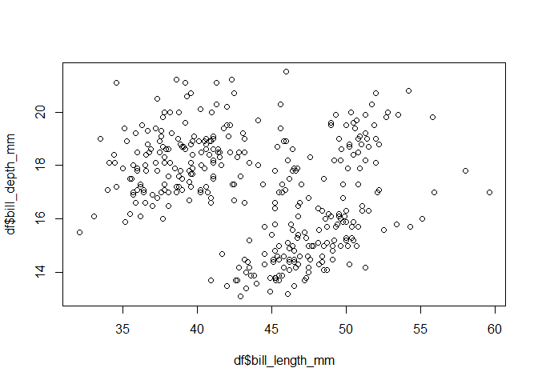

Untitled
================
23 October, 2024

This manuscript uses the Workflow for Open Reproducible Code in Science
(Van Lissa et al. 2021) to ensure reproducibility and transparency. All
code <!--and data--> are available at
<https://github.com/cjvanlissa/worcstest.git>.

This is an example of a non-essential citation (@ Van Lissa et al.
2021). If you change the rendering function to `worcs::cite_essential`,
it will be removed.

<!--The function below inserts a notification if the manuscript is knit using synthetic data. Make sure to insert it after load_data().-->

## GitHub Documents

This is an R Markdown format used for publishing markdown documents to
GitHub. When you click the **Knit** button all R code chunks are run and
a markdown file (.md) suitable for publishing to GitHub is generated.

## Including Code

You can include R code in the document as follows:

``` r
summary(df)
```

    ##       species          island    bill_length_mm  bill_depth_mm   flipper_length_mm
    ##  Adelie   :152   Biscoe   :168   Min.   :32.10   Min.   :13.10   Min.   :172.0    
    ##  Chinstrap: 68   Dream    :124   1st Qu.:39.23   1st Qu.:15.60   1st Qu.:190.0    
    ##  Gentoo   :124   Torgersen: 52   Median :44.45   Median :17.30   Median :197.0    
    ##                                  Mean   :43.92   Mean   :17.15   Mean   :200.9    
    ##                                  3rd Qu.:48.50   3rd Qu.:18.70   3rd Qu.:213.0    
    ##                                  Max.   :59.60   Max.   :21.50   Max.   :231.0    
    ##                                  NA's   :2       NA's   :2       NA's   :2        
    ##   body_mass_g  
    ##  Min.   :2700  
    ##  1st Qu.:3550  
    ##  Median :4050  
    ##  Mean   :4202  
    ##  3rd Qu.:4750  
    ##  Max.   :6300  
    ##  NA's   :2

## Including Plots

You can also embed plots, for example:

<!-- -->

Note that the `echo = FALSE` parameter was added to the code chunk to
prevent printing of the R code that generated the plot.

|                   | Estimate | Std. Error | t value | Pr(\>\|t\|) |
|:------------------|---------:|-----------:|--------:|------------:|
| (Intercept)       |    -3.44 |       4.58 |   -0.75 |        0.45 |
| body_mass_g       |     0.00 |       0.00 |    1.17 |        0.24 |
| flipper_length_mm |     0.22 |       0.03 |    6.86 |        0.00 |

<div id="refs" class="references csl-bib-body hanging-indent"
entry-spacing="0">

<div id="ref-vanlissaWORCSWorkflowOpen2021" class="csl-entry">

Van Lissa, Caspar J., Andreas M. Brandmaier, Loek Brinkman, Anna-Lena
Lamprecht, Aaron Peikert, Marijn E. Struiksma, and Barbara M. I. Vreede.
2021. “WORCS: A Workflow for Open Reproducible Code in Science.” *Data
Science* 4 (1): 29–49. <https://doi.org/10.3233/DS-210031>.

</div>

</div>
